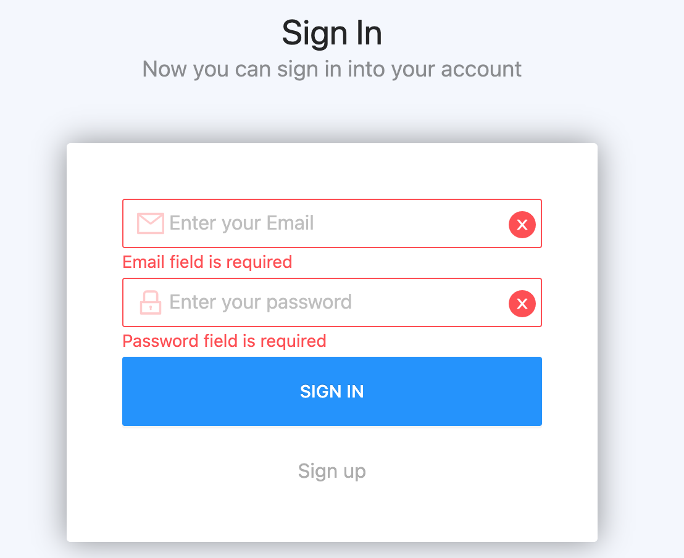
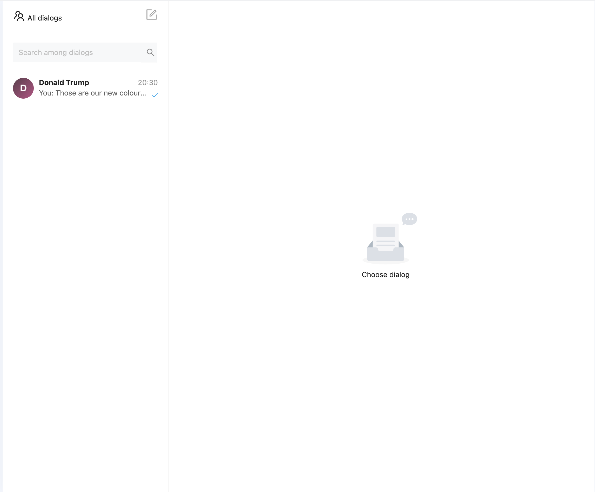
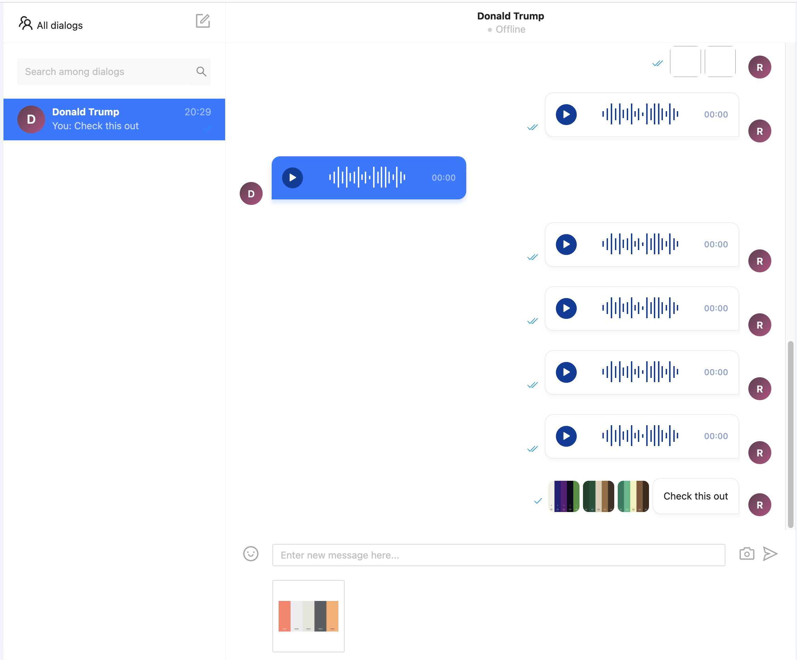
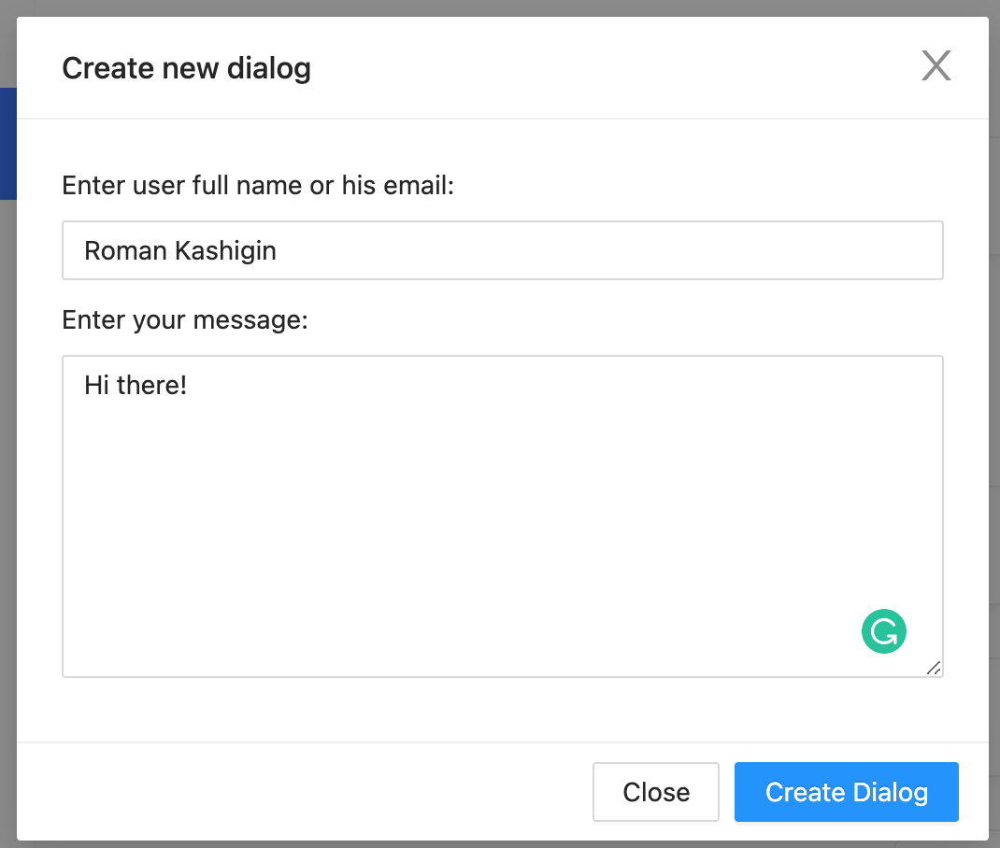

# React Chat App
_Project purpose: learn how to use Socket.io, how to send voice messages and pictures (using Cloudinary)

## Functionality
+ Registration
+ Authorization
+ Creation of a new dialog
+ Sending messages via sockets
+ Sending pictures
+ Sending voice messages
+ Sending Emojis

## Technologies

+ Frontend
  + React
  + Ant Design
  + Redux
  + React Hooks
  + React Router
  + SASS
  + Formik
  + Date-fns
  + Axios
+ Backend
  + Node.js
  + ExpressJS
  + Typescript (backend)
  + MongoDB & Mongoose
  + JWT
  + Cloudinary
  + Multer

### Sign in page

### Sign in page (with form errors)

### Sign in page (with successful form data)

### Sign up page

### All dialogs choosing

### Opened dialog

### Create dialog

